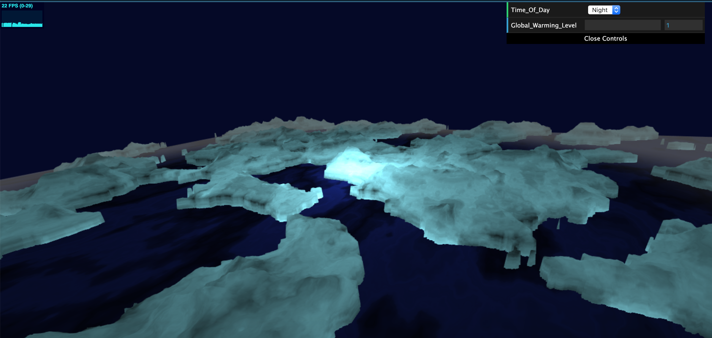
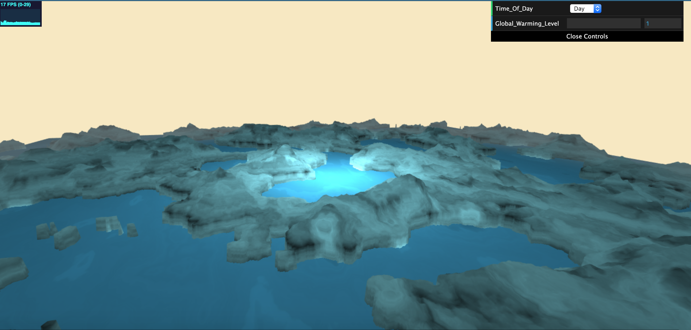
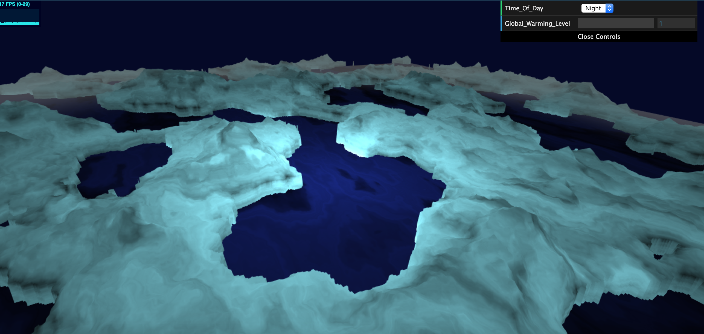
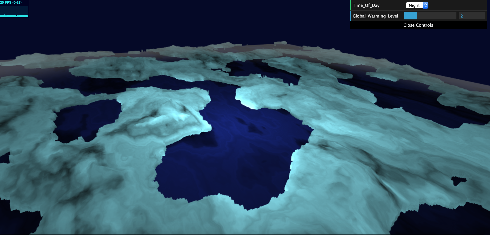
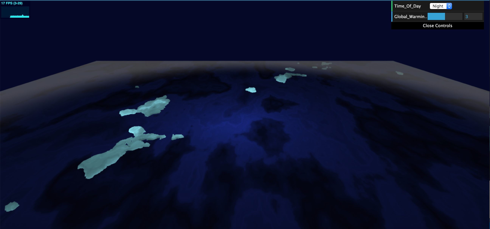

# CIS 566 Homework 1: Noisy Terrain
## Catherine Yang, PennKey: catyang

## https://catyang97.github.io/hw01-noisy-terrain/

## Ice Caps
### Ice at Night

### Ice During the Day

### Melting Ice Caps: A Series
  

## Techniques
- For the icebergs and the moisture, I used FBMs to generate height maps and varying moisture
values. 
- To generate colors, I also used separate FBM noise functions for the icebergs and the water. The position of the light vector was  factored in as well.
- In the GUI, the user can change the "Time_Of_Day" from Night to Day to adjust the color of the sky and water. Additionally, the "Global_Warming_Level" can be adjusted to change the distribution so the ice levels shrink and rise.
